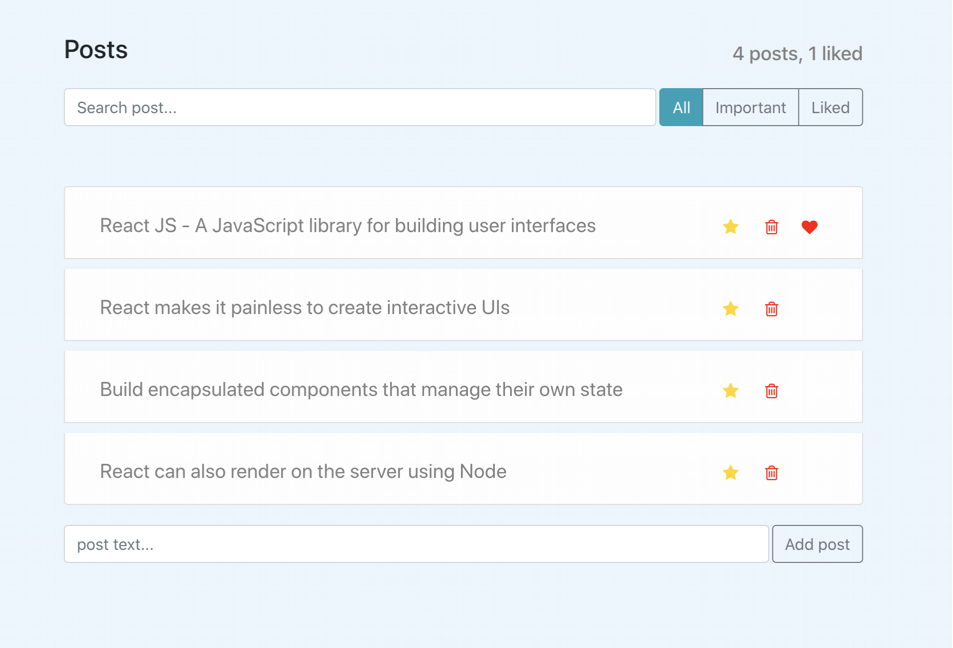

# Posts React App

This project was bootstrapped with [Create React App](https://github.com/facebook/create-react-app).
You can add, edit, delete, mark as liked posts.

## See [App](https://quizzical-poincare-b8d35c.netlify.app/)

## Available Scripts
In the project directory, you can run:

### `yarn start`
Runs the app in the development mode.

### `yarn test`

Launches the test runner in the interactive watch mode.

### `yarn build`
Builds the app for production to the `build` folder.
